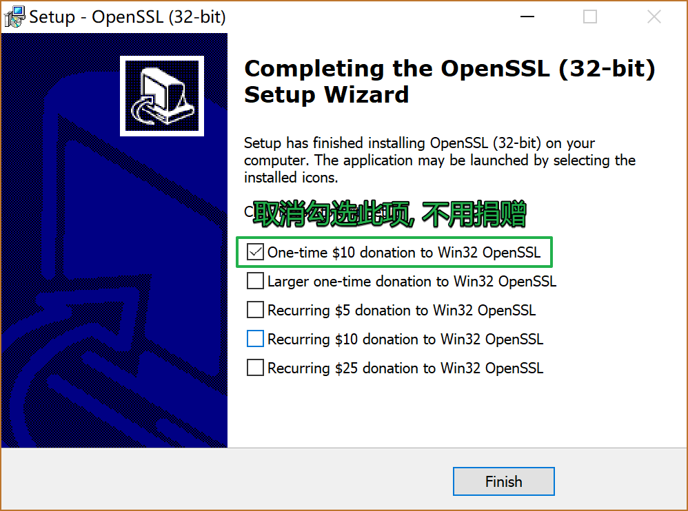
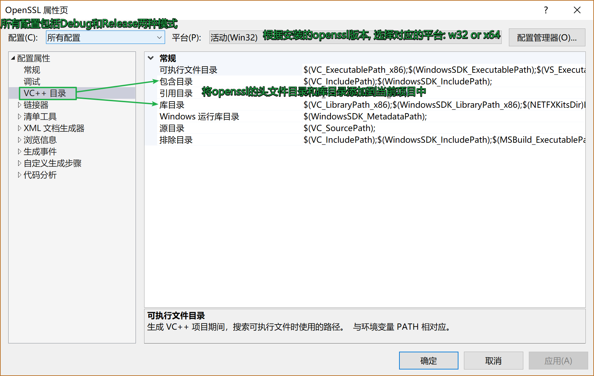
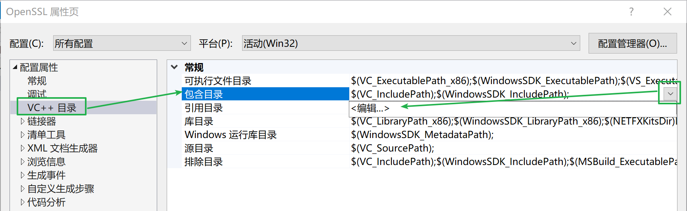

## 1. 安装

### 1.1 windows下安装openssl




恭喜，OpenSSL安装完成。

### 1.2 Linux下安装OpenSSL

1. 下载安装包, 下载地址:  https://github.com/openssl/openssl

2. 源码安装包解压缩

   - .zip格式: 

     ```shell
     unzip openssl.zip
     ```

   - .tar.gz格式:

     ```shell
      tar zxvf openssl.tar.gz
     ```

   - .tar.bz格式:

     ```shell
      tar jxvf openssl.tar.gz
     ```

3. 进入解压目录, 安装（可参考安装文件INSTALL）:

   ```shell
   ./config
   make
   make test 		（可选）
   make install	 (使用管理员权限执行该命令)
   ```

4. 验证是否安装成功

   ```shell
   openssl version -a
   ```

   > 输出结果

   ```shell
   OpenSSL 1.1.1-pre6-dev  xx XXX xxxx
   built on: Mon Apr 23 10:53:02 2018 UTC
   platform: linux-x86_64
   options:  bn(64,64) rc4(16x,int) des(int) idea(int) blowfish(ptr) 
   compiler: gcc -fPIC -pthread -m64  -Wa,--noexecstack -Wall -O3 -DOPENSSL_USE_NODELETE -DL_ENDIAN -DOPENSSL_PIC -DOPENSSL_CPUID_OBJ -DOPENSSL_IA32_SSE2 -DOPENSSL_BN_ASM_MONT -DOPENSSL_BN_ASM_MONT5 -DOPENSSL_BN_ASM_GF2m -DSHA1_ASM -DSHA256_ASM -DSHA512_ASM -DRC4_ASM -DMD5_ASM -DAES_ASM -DVPAES_ASM -DBSAES_ASM -DGHASH_ASM -DECP_NISTZ256_ASM -DX25519_ASM -DPADLOCK_ASM -DPOLY1305_ASM -DNDEBUG
   OPENSSLDIR: "/usr/local/ssl"
   ENGINESDIR: "/usr/local/lib64/engines-1.1"
   Seeding source: os-specific
   ```

   ​

## 2  VS中使用openssl

> 打开VS, 创建一个空的控制台应用程序


> 设置项目属性, 打开项目的属性面板



> 添加openssl头文件目录




> 添加openssl的库目录


> 配置完毕


## 3. 测试

###3.1 VS中的相关设置

> 打开项目属性窗口, 添加openssl相关的库到项目中
>
> ==**项目属性 -> 链接器 -> 输入 -> 附件依赖项**==
>
> - **libssl.lib**
> - **libcrypto.lib**


> 将openssl安装目录/bin目录下(**C:\OpenSSL-Win32\bin**)的两个动态库拷贝到工作目录下: 
>
> - **libcrypto-1_1.dll**
> - **libssl-1_1.dll**
>
> ==**C:\OpenSSL-Win32 是我的openssl安装目录**==
>
> 如图所示:
>

>
> 

测试代码如下:

```c
#define _CRT_SECURE_NO_WARNINGS
//#include <openssl/md5.h>		// md5 头文件
#include <stdio.h>
#include <string.h>
#include <stdlib.h>
#include <openssl/evp.h>

void getMD5(const char* str, char* result)
{
	EVP_MD_CTX* mdctx;
	unsigned int md5_digest_len = EVP_MD_size(EVP_md5());//求属性长度
    //MD5_CTX ctx;
	
	// 初始化
	//MD5_Init(&ctx);
	mdctx = EVP_MD_CTX_new();
	EVP_DigestInit_ex(mdctx, EVP_md5(), NULL);

	// 添加数据
	//MD5_Update(&ctx, str, strlen(str));
	EVP_DigestUpdate(mdctx, str, strlen(str));

	// 计算结果
	unsigned char md[16] = { 0 };
	
	//MD5_Final(md, &ctx);
	EVP_DigestFinal_ex(mdctx, md, &md5_digest_len);

	for (int i = 0; i < 16; ++i)
	{
		sprintf(&result[i * 2], "%02x", md[i]);
	}
	EVP_MD_CTX_free(mdctx);
}

int main()
{
	char result[33] = { 0 };
	getMD5("hello, md5", result);
	printf("md5 value: %s\n", result);
	system("pause");

	return 0;
}
```

```c
输出结果: 
	md5 value: 33b3bc8e05b4fcc16bd531dd9adac166

可参考md5_test.c文件夹
```

### 3.2 Linux下的使用和测试

1. 编程应用程序,  测试代码如上, 文件名为  `md5_test.c`

2. 通过gcc编译源文件

   ```shell
   gcc md5_test.c -o md5 -lssl -lcrypto
   执行该命令, 需要加载openssl的两个动态库
   	- libssl.so
   	- libcrypto.so
   ```

3. 查看生成的可执行程序 md5 运行时需要加载的动态库

   ```shell
   ldd md5
   ```

   输出结果:

   ```shell
   linux-vdso.so.1 =>  (0x00007ffdac781000)
   libssl.so.1.1 => not found
   libcrypto.so.1.1 => not found
   libc.so.6 => /lib64/libc.so.6 (0x00007f365c3aa000)
   /lib64/ld-linux-x86-64.so.2 (0x00007f365c782000)
   ```

   **提示动态库 ==libssl.so.1.1== 和 ==libcrypto.so.1.1== 链接不到 **

4. 通过find查找两个动态库的位置

   ```shell
   find / -name "libssl.so.1.1"
   输出结果:
   /root/openssl-master/libssl.so.1.1
   /usr/local/lib64/libssl.so.1.1

   find / -name "libcrypto.so.1.1"
   输出结果:
   /root/openssl-master/libcrypto.so.1.1
   /usr/local/lib64/libcrypto.so.1.1
   ```

   **通过对输出结果的分析, 得出结论动态库所在的目录为:  ==/usr/local/lib64==** 

5. 解决问题, 将找到的**动态库绝对路径**添加到 ==**/etc/ld.so.conf**== 文件中, 并**使用管理员权限执行命令==ldconfig==**

   ```go
   sudo vim /etc/ld.so.conf
   将/usr/local/lib64 添加到文件末尾, 保存退出配置文件
   更新配置:
   sudo ldconfig
   ```

6. 验证

   ```shell
   ldd md5
           linux-vdso.so.1 =>  (0x00007ffcd8fe0000)
           libssl.so.1.1 => /usr/local/lib64/libssl.so.1.1 (0x00007fb7aae7d000)
           libcrypto.so.1.1 => /usr/local/lib64/libcrypto.so.1.1 (0x00007fb7aa9a2000)
           libc.so.6 => /lib64/libc.so.6 (0x00007fb7aa5e1000)
           libdl.so.2 => /lib64/libdl.so.2 (0x00007fb7aa3dd000)
           libpthread.so.0 => /lib64/libpthread.so.0 (0x00007fb7aa1c0000)
           /lib64/ld-linux-x86-64.so.2 (0x00007fb7ab123000)
   ```

   ​

